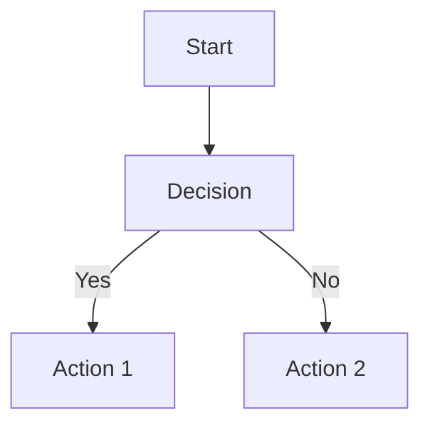
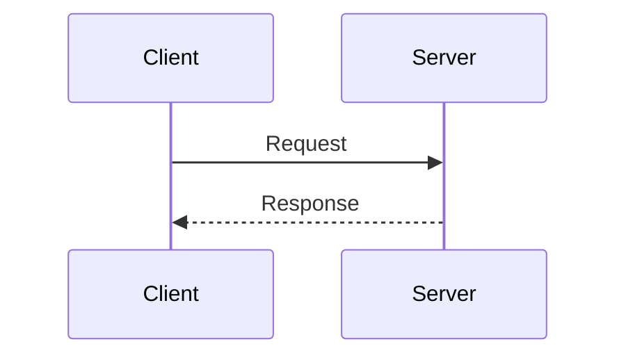

# Tech Changes Tracker

A minimal, professional HTML-based website for tracking technical changes, decisions, and architecture updates. Perfect for hosting on GitHub Pages.

## Features

- 🔐 Simple authentication (hardcoded credentials)
- 🔍 Full-text search across all entries
- 📊 Mermaid.js diagram support
- 📝 Track changes, decisions, and rationale
- 🏷️ Tag-based organization
- 👤 Author tracking
- 🔗 PR and Figma link integration
- 💾 LocalStorage persistence

## Default Credentials

- **Username:** `admin`
- **Password:** `internal2024`

## Quick Start

1. **Local Testing:** Open `index.html` in your browser
2. **GitHub Pages:** See [GITHUB_PAGES_SETUP.md](./GITHUB_PAGES_SETUP.md) for deployment instructions

## Adding New Entries

### Method 1: Using Browser Console

After logging in, open the browser console (F12) and run:

```javascript
updateTechChanges({
    title: "Your Change Title",
    date: "2024-02-05",
    author: "Your Name",
    prLink: "https://github.com/org/repo/pull/123",
    figmaLink: "https://www.figma.com/file/abc123/design",
    description: "Brief description of the change",
    changes: [
        "Change 1",
        "Change 2",
        "Change 3"
    ],
    decisions: "Detailed explanation of decisions made and rationale",
    diagram: `graph TD
    A[Start] --> B[Process]
    B --> C[End]`,
    tags: ["Tag1", "Tag2"]
});
```

### Method 2: Using Helper Script

```bash
# Create entry JSON file
# Then run:
node update-entry.js entry.json
# Copy the output and paste in browser console
```

## Data Structure

Each entry follows this structure:

```json
{
    "title": "Change Title",
    "date": "YYYY-MM-DD",
    "author": "Author Name",
    "prLink": "https://github.com/org/repo/pull/123",
    "figmaLink": "https://www.figma.com/file/abc123/design",
    "description": "Brief description",
    "changes": [
        "Change item 1",
        "Change item 2"
    ],
    "decisions": "Detailed decisions and rationale",
    "diagram": "Mermaid.js diagram code",
    "tags": ["Tag1", "Tag2"]
}
```

**Note:** `author`, `prLink`, `figmaLink`, `diagram`, and `tags` are optional fields.

## Mermaid Diagram Examples

The website supports all Mermaid diagram types. Here are some examples:

### Flowchart


### Sequence Diagram


## Workflow Integration

After making commits, you can:

1. Check git diff
2. Create Mermaid diagrams
3. Write engineering documentation
4. Update the tracker using the `updateTechChanges()` function

See [WORKFLOW.md](./WORKFLOW.md) for detailed workflow integration guide.

## Customization

- **Change credentials:** Edit the `CREDENTIALS` object in the JavaScript section
- **Modify styling:** Edit the `<style>` section
- **Add features:** Extend the JavaScript functionality

## Browser Compatibility

Works in all modern browsers that support:
- ES6 JavaScript
- LocalStorage API
- CSS Grid and Flexbox

## Multiple HTML Files

The tracker automatically discovers HTML files in the directory. Just add an HTML file and it will appear in the file browser!

### Adding a New HTML File

1. **Add your HTML file** to the directory (e.g., `my-tracker.html`)
2. **Auto-update files.json** (runs automatically on commit, or run manually):
   ```bash
   node auto-update-files.js
   ```
3. **Commit and push**:
   ```bash
   git add my-tracker.html files.json
   git commit -m "Add my-tracker.html"
   git push
   ```

**Note:** A git pre-commit hook automatically runs `auto-update-files.js` to keep `files.json` in sync with your HTML files.

## Files

- `index.html` - Main application file with file browser (ready for GitHub Pages)
- `files.json` - Manifest of all HTML tracker files
- `GITHUB_PAGES_SETUP.md` - Deployment instructions
- `WORKFLOW.md` - Workflow integration guide
- `SCAFFOLD_PROMPT.md` - Prompt for recreating in other projects
- `example-entry.json` - Example entry structure
- `update-entry.js` - Helper script for generating console code
- `update-files-list.js` - Helper script to add files to files.json
